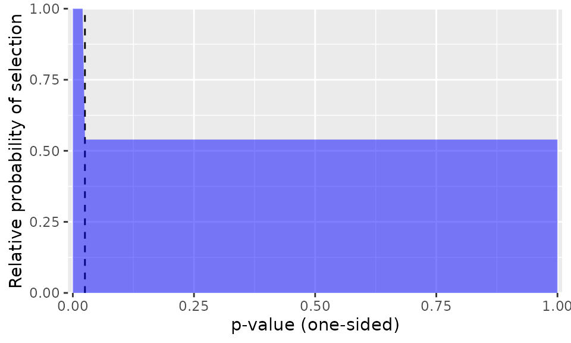
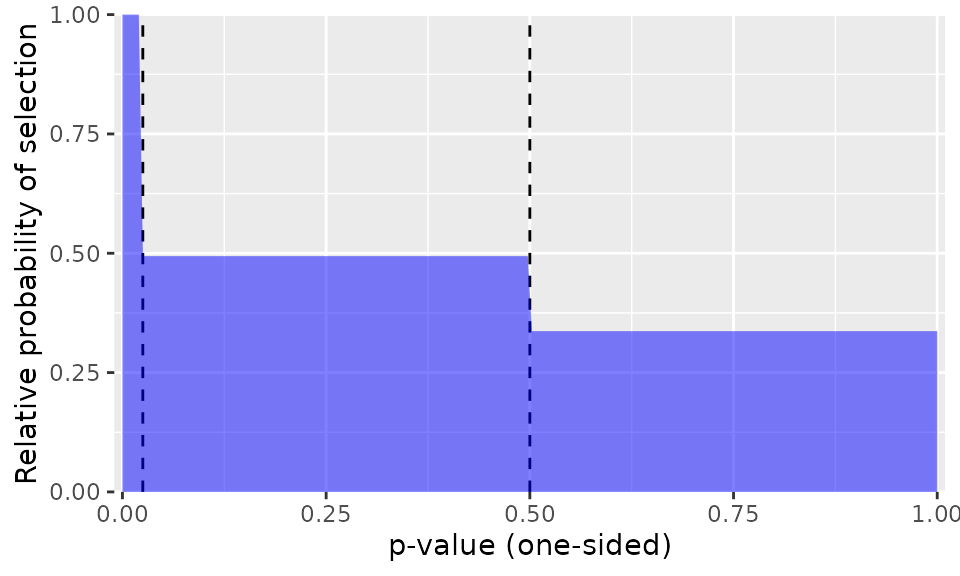
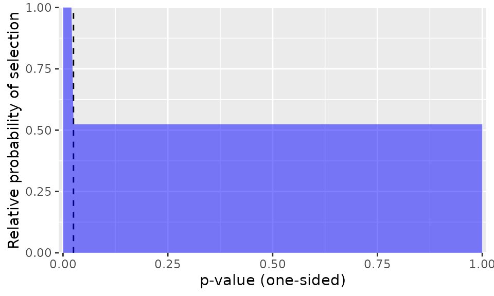
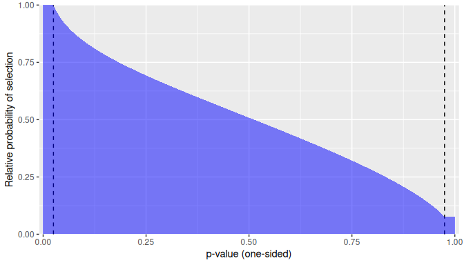

# P-Value Selection Models for Meta-Analysis with Dependent Effects

A systematic review and meta-analysis project aims to provide a
comprehensive synthesis of available evidence on a topic of interest.
One major challenge to this aim is selective reporting of evidence from
primary studies. Selective reporting occurs when the direction or
statistical significance level of a finding influences whether it is
reported and therefore whether the finding is available for inclusion in
a systematic review. Selective reporting can arise from biases in the
publication process, on the part of journals, editors, and reviewers, as
well as through strategic decisions on part of the authors ([Rothstein,
Sutton, & Borenstein, 2005](#ref-Rothstein2005publication); [Sutton,
2009](#ref-sutton2009publication)). If results that are positive and
statistically significant are more likely to be reported than results
that are null or negative, the evidence base available for meta-analysis
will be distorted, leading to inflated effect size estimates from
meta-analysis ([Carter, Schönbrodt, Gervais, & Hilgard,
2019](#ref-carter2019correcting); [McShane, Böckenholt, & Hansen,
2016](#ref-mcshane2016adjusting)) and biased estimates of heterogeneity
([Augusteijn, van Aert, & van Assen, 2019](#ref-augusteijn2019effect)).

Because selective reporting can make it difficult to draw accurate
inferences from a meta-analysis, many tools have been developed that try
to detect selective reporting problems and correct for the biases they
create in meta-analytic summaries. Widely used methods include graphical
diagnostics like funnel plots ([Sterne & Egger,
2001](#ref-sterne2001funnel); [Sterne et al.,
2011](#ref-Sterne2011recommendations)); tests and adjustments for funnel
plot asymmetry such as trim-and-fill ([Duval & Tweedie,
2000](#ref-duval2000nonparametric)), Egger’s regression ([Egger, Smith,
Schneider, & Minder, 1997](#ref-egger1997bias)), and PET/PEESE
([Stanley, 2008](#ref-stanley2008meta); [Stanley & Doucouliagos,
2014](#ref-stanley2014meta)); and $`p`$-value diagnostics such as
p-curve and p-uniform ([Aert, Wicherts, & Assen,
2016](#ref-vanaert2016conducting); [Assen, Van Aert, & Wicherts,
2015](#ref-VanAssen2015meta); [Simonsohn, Nelson, & Simmons,
2014](#ref-simonsohn2014pcurve)). Selection models are another class of
methods that both test and correct for selective reporting by directly
modeling the section process ([Citkowicz & Vevea,
2017](#ref-Citkowicz2017parsimonious); [Hedges,
1992](#ref-hedges1992modeling); [Hedges & Vevea,
1996](#ref-Hedges1996estimating); [Vevea & Hedges,
1995](#ref-vevea1995general)). However, very few methods for
investigating selective reporting can accommodate dependent effect
sizes. This limitation poses a problem for meta-analyses in education,
psychology and other social sciences, where dependent effects are a
common feature of meta-analytic data.

Dependent effect sizes occur when primary studies report results for
multiple measures of an outcome construct, collect repeated measures of
an outcome across multiple time-points, or involve comparisons between
multiple intervention conditions. This dependency violates statistical
assumptions of independent errors, leading to overly narrow confidence
intervals, hypothesis tests with inflated type one error rates, and
incorrect inferences. Meta-analysts now have access to an array of
methods for summarizing and modeling dependent effect sizes, including
multi-level meta-analyses ([Konstantopoulos,
2011](#ref-konstantopoulos2011fixed); [Van den Noortgate, López-López,
Marín-Martínez, & Sánchez-Meca,
2013](#ref-vandennoortgate2013threelevel),
[2015](#ref-vandennoortgate2015metaanalysis)), robust variance
estimation ([Hedges, Tipton, & Johnson, 2010](#ref-Hedges2010robust);
[Tipton, 2015](#ref-tipton2015small); [Tipton & Pustejovsky,
2015](#ref-tiptonpusto2015small)), and combinations thereof
([Pustejovsky & Tipton, 2022](#ref-pustejovsky2022preventionscience)).
These methods can be combined with a few of the available techniques for
investigating selective reporting, but this is currently limited to
techniques based on regression adjustment ([Chen & Pustejovsky,
2024](#ref-chen2024adapting); [Fernández-Castilla et al.,
2019](#ref-fernandezcastilla2019detecting); [Rodgers & Pustejovsky,
2020](#ref-rodgers2020evaluating)) or sensitivity analyses based on
simple forms of selection models, which provide bounds on average
effects given an *a priori* level of selective reporting ([Mathur &
VanderWeele, 2020](#ref-mathur2020sensitivity)).

The `metaselection` package aims to expand the range of techniques
available for investigating selective reporting bias while also
accommodating meta-analytic datasets that include dependent effect
sizes. In particular, the package provides methods for investigating and
accounting for selective reporting based on selection models, where
prior developments were limited to data with independent effect sizes.
The available models describe the *marginal* distribution of effect size
estimates and so do not attempt to directly capture the dependence
structure among effect size estimates. However, the package implements
methods that account for dependent effect sizes after fitting the model,
using either cluster-robust variance estimation (CRVE, i.e., sandwich
estimation) or clustered bootstrapping techniques. Simulation results
show that applying selection models to dependent effect size estimates
reduces bias in the estimate of the overall effect size ([Pustejovsky,
Citkowicz, & Joshi, 2025](#ref-pustejovsky2025estimation)). Combining
the selection models with cluster-bootstrapping leads to confidence
intervals with close-to-nominal coverage rates ([Pustejovsky et al.,
2025](#ref-pustejovsky2025estimation)).

Several existing packages provide implementations of selection models,
but none can accommodate dependent effect size estimates. For example,
the `metafor` package ([Viechtbauer,
2010](#ref-Viechtbauer2010conducting)) includes the
[`selmodel()`](https://wviechtb.github.io/metafor/reference/selmodel.html)
function, which allows users to fit many different types of selection
models. The `weightr` package ([Coburn & Vevea, 2019](#ref-weightr))
includes functions to estimate a class of $`p`$-value selection models
described in Vevea & Hedges ([1995](#ref-vevea1995general)). However,
the functions available in these packages can only be applied to
meta-analytic data assuming that the effect sizes are independent. In
addition, the `PublicationBias` package ([Braginsky, Mathur, &
VanderWeele, 2023](#ref-PublicationBias)) implements sensitivity
analyses for selective reporting bias that incorporate cluster-robust
variance estimation methods for handling dependent effect sizes.
However, the sensitivity analyses implemented in the package are based
on a pre-specified degree of selective reporting, rather than allowing
the degree of selection to be estimated from the data. The sensitivity
analyses are also based on a specific and simple form of selection model
and do not allow modeling of more complex forms of selection.

## Selection Models

Selection models are a tool for investigating selective reporting by
making explicit assumptions about the process by which the effect size
estimates are reported ([Rothstein et al.,
2005](#ref-Rothstein2005publication)). Such models have two components:
a set of assumptions describing the evidence-generation process and a
set of assumptions describing the selection process. The `metaselection`
package implements a flexible class of selection models, in which the
evidence-generating process follows a random effects location-scale
meta-regression model ([Viechtbauer & López‐López,
2022](#ref-viechtbauer2022locationscale)) and where the selection
process is a function of one-sided $`p`$-values, either in the form of a
step function ([Vevea & Hedges, 1995](#ref-vevea1995general)) or a
beta-density function ([Citkowicz & Vevea,
2017](#ref-Citkowicz2017parsimonious)). The step function model involves
specifying psychologically salient but functionally arbitrary thresholds
(or steps), such as $`p < 0.05`$, which categorize the $`p`$-values into
intervals that have different probabilities of selection ([Vevea &
Hedges, 1995](#ref-vevea1995general)). The beta-density model uses a
different selection function, based on a beta distribution, to capture
distinctive, more smoothly varying patterns of selection ([Citkowicz &
Vevea, 2017](#ref-Citkowicz2017parsimonious)).

Consider a meta-analytic dataset with a total of $`J`$ samples, where
study $`j`$ includes $`k_j`$ effect size estimates. Let $`Y_{ij}`$
denote an effect size estimate produced by a sample, prior to selective
reporting. The effect size estimate has standard error $`\sigma_{ij}`$,
which is treated as a fixed quantity. Let $`\mathbf{x}_{ij}`$ be a
$`1 \times x`$ row vector of predictors that encode characteristics of
the effect sizes or the samples and may be related to average effect
size magnitude. Let $`\mathbf{u}_{ij}`$ be a $`1 \times u`$ row vector
of predictors that may be related to effect size heterogeneity. Let
$`\Phi()`$ denote the standard normal cumulative distribution function
and $`\phi()`$ the standard normal density. Finally, let $`p_{ij}`$ be
the one-sided $`p`$-value corresponding to the effect size estimate,
which is a function of the effect size estimate and its standard error:
$`p_{ij} = 1 - \Phi\left(Y_{ij} / \sigma_{ij}\right) = \Phi\left(-Y_{ij} / \sigma_{ij}\right)`$.

### The evidence-generating process

The model for the evidence-generating process is a random effects
location-scale meta-regression model, in which
``` math
Y_{ij} = \mathbf{x}_{ij} \boldsymbol\beta + v_{ij} + e_{ij},
```
where $`\boldsymbol\beta`$ is a $`1 \times x`$ vector of regression
coefficients that relate the predictors to average effect size
magnitude, $`v_i`$ is a normally distributed random effect with mean
zero and variance $`\tau^2_{ij}`$, and $`e_{ij}`$ is a normally
distributed sampling error with mean zero and known variance
$`\sigma^{2}_{ij}`$. The variance of the random effects is modeled as
``` math
\log\left(\tau_{ij}^{2}\right) = \mathbf{u}_{ij} \boldsymbol\gamma,
```
where $`\boldsymbol\gamma`$ is a $`u \times 1`$ vector of coefficients
that relate the predictors to the degree of marginal variation in the
random effects. If the model does not include predictors of
heterogeneity, then $`\mathbf{u}_{ij} = 1`$ and the model reduces to a
conventional random effects meta-regression in which
$`\gamma = \log(\tau^2)`$.

Note that this random-effects location scale model treats each observed
effect size as if it were independent, even though the data may include
multiple, statistically dependent effect size estimates generated from
the same sample. Thus, it is a model for the *marginal* distribution of
effect size estimates, which does not attempt to capture the dependence
structure among effect size estimates drawn from the same sample. As a
result, the regression coefficients $`\boldsymbol\beta`$ describe the
overall average effects (given the predictors) and variance parameters
$`\boldsymbol\gamma`$ describe the marginal or *total* heterogeneity of
the effect size distribution, rather than decomposing the heterogeneity
into within-sample and between-sample components.

### Selective reporting processes

The selective reporting process is defined by a selection function,
which specifies the probability that an effect size estimate is reported
given its $`p`$-value. Let $`O_{ij}`$ be an indicator for whether effect
size $`i`$ in study $`j`$ is observed. Then the selection model defines
$`\text{Pr}(O_{ij} = 1 \ | \ p_{ij}) = \text{Pr}(O_{ij} = 1 \ | \ Y_{ij}, \sigma_{ij})`$.
The package includes two different forms of selection functions: step
functions and beta-density functions.

Although it is possible in principle to specify selection functions in
terms of $`p`$-values from two-tailed hypothesis tests, the models
implemented in the package are based on selection functions for
one-tailed $`p`$-values. In primary studies, researchers typically
report $`p`$-values from two-tailed hypothesis tests. However, prejudice
against non-significant results is generally directional, and two-tailed
$`p`$-values do not consider the sign or valence of the effect. Thus,
our formulation and discussion of these functions uses one-tailed
$`p`$-values based on the null hypothesis of $`H_0: \theta \leq 0`$
versus the alternative $`H_A: \theta > 0`$.

#### Step functions

Hedges ([1992](#ref-hedges1992modeling)) and Vevea & Hedges
([1995](#ref-vevea1995general)) proposed to model the selective
reporting process using a step-function, with thresholds chosen to
correspond to “psychologically salient” $`p`$-values. In the general
formulation, suppose that there are $`H`$ steps,
$`\alpha_1,...,\alpha_H`$, and that
``` math
\text{Pr}(O_{ij} = 1 | p_{ij}) = \begin{cases}
1 & \text{if} & p_{ij} < \alpha_1 \\ 
\lambda_1 & \text{if} & \alpha_1 \leq p_{ij} < \alpha_2 \\ \lambda_2 & \text{if} & \alpha_2 \leq p_{ij} < \alpha_3 \\
\vdots \\
\lambda_H & \text{if} & \alpha_H \leq p_{ij}.
\end{cases}
```
The selection parameters $`\lambda_1,...,\lambda_H`$ control the
probabilities of selection given a $`p`$-value, with parameter
$`\lambda_h`$ defined as the relative probability that an effect size
estimate is observed, given that its $`p`$-value is in the range
$`[\alpha_h, \alpha_{h+1})`$, compared to the probability that an effect
size estimate is observed, given that its $`p`$-value is in the range
$`[0, \alpha_1)`$. The model is estimated in terms of log-transformed
relative probabilities so that the parameter space is unrestricted, with
$`\zeta_h = \log(\lambda_h)`$, where $`-\infty < \zeta_h < +\infty`$,
for $`h=1,...,H`$. With this parameterization,
$`\zeta_1 = \cdots = \zeta_H = 0`$ describes a process where effect
sizes are reported with uniform probability regardless of their signs or
statistical significance levels.

In practice, meta-analysts will often use only a small number of steps
in the selection model. One common choice is the three-parameter
selection model, which has a single step at $`\alpha_1 = 0.025`$ (the
default in the package), as depicted in the first figure below. With
this choice of threshold, positive effects that are statistically
significant at the two-sided level of $`p < 0.05`$ have a different
probability of selection than effects that are not statistically
significant or not in the anticipated direction.


One-step selection model with $`\lambda_1 = 0.4`$

Another possibility is to use two steps at $`\alpha_1 = 0.025`$ and
$`\alpha_2 = 0.500`$, which allows for different probabilities of
selection for effects that are positive but not statistically
significant and effects that are negative (i.e., in the opposite the
intended direction). We call the latter model a four-parameter selection
model; it is depicted in the figure below.


Two-step selection model with $`\lambda_1 = 0.4, \lambda_2 = 0.2`$

#### Beta-density functions

Citkowicz & Vevea ([2017](#ref-Citkowicz2017parsimonious)) proposed a
selection model based on an alternative form of selection function,
where the probability of reporting follows a beta density. Compared to a
step function, the beta density selection function can capture a very
different set of shapes, with selection probabilities that vary smoothly
over the range of possible one-sided $`p`$-values. The `metaselection`
package implements a modification of the beta-density function as
originally proposed in Citkowicz & Vevea
([2017](#ref-Citkowicz2017parsimonious)). The modification involves
truncating the selection probabilities at user-specified steps
$`\alpha_1`$ and $`\alpha_2`$, so that the selection function is given
by
``` math
\text{Pr}(O_{ij} = 1 | p_{ij}) = \tilde{p}_{ij}^{(\lambda_1 - 1)} \left(1 - \tilde{p}_{ij}\right)^{(\lambda_2 - 1)},
```
where $`\tilde{p}_{ij} = \min\{\max\{p_{ij}, \alpha_1\}, \alpha_2\}`$.
Using this modification, one might set truncation points at
$`\alpha_1 = 0.025`$ and $`\alpha_2 = 0.975`$ (the default values in the
package) so that all statistically significant positive effect size
estimates have the same selection probability and, likewise, all
statistically significant, negative effect size estimates have the same
selection probability, with the selection probabilities of
non-significant effect sizes varying according to a beta density. The
first figure below depicts this truncated beta density using the default
truncation points and with $`\lambda_1 = 0.1, \lambda_2 = 0.9`$, which
represents very strong selection. The second figure depicts a truncated
beta density with more moderate values of
$`\lambda_1 = 0.7, \lambda_2 = 1`$ and where the second truncation point
is set at $`\alpha_2 = 0.5`$, so that all negative effect size estimates
have equal selection probability.


Beta-density selection model with $`\lambda_1 = 0.1, \lambda_2 = 0.9`$,
using truncation points $`\alpha_1 = 0.025, \alpha_2 = 0.975`$


Beta-density selection model with $`\lambda_1 = 0.7, \lambda_2 = 1`$,
using truncation points $`\alpha_1 = 0.025, \alpha_2 = 0.500`$

In the package, the beta-density function is parameterized in terms of
$`\zeta_h = \log(\lambda_h)`$, where $`-\infty < \zeta_h < +\infty`$,
for $`h=1,2`$. With this parameterization, $`\zeta_1 = \zeta_2 = 0`$
describes a process where effect sizes are reported with uniform
probability regardless of their statistical significance levels.

### Estimation

The combination of assumptions about the evidence-generating process and
assumptions about the selection process implies a marginal distribution
for the observed effect sizes. The evidence-generating process describes
the effect size distribution
$`\text{Pr}(Y_{ij} = y_{ij} \ | \ \sigma_{ij}, \mathbf{x}_{ij}, \mathbf{u}_{ij})`$
and the selection process specifies
$`\text{Pr}(O_{ij} = 1 \ | \ Y_{ij} = y, \sigma_{ij}, \mathbf{x}_{ij}, \mathbf{u}_{ij})`$.
The distribution of observed effect size estimates then corresponds to
$`\text{Pr}(Y_{ij} = y_{ij} \ | \ O_{ij} = 1, \sigma_{ij}, \mathbf{x}_{ij}, \mathbf{u}_{ij})`$,
which depends on the meta-regression coefficients $`\boldsymbol\beta`$,
the scale regression coefficients $`\boldsymbol\gamma`$, and the
selection parameters $`\boldsymbol\zeta`$.

The `metaselection` package implements two different estimation
strategies: composite marginal likelihood and augmented and reweighted
Gaussian likelihood. In the first, model parameter estimates are
obtained by taking the values that maximize the log-likelihood of the
observations, treating each effect size estimate as if it were
independent. An alternative estimation strategy, augmented and
reweighted Gaussian likelihood, defines the parameter estimator as the
solution to a set of mean-zero estimating equations. The selection
parameters are estimated using their score equations, just as in the
composite marginal likelihood estimator. Unlike the composite marginal
likelihood strategy, the meta-regression coefficients and scale
regression coefficients are estimated using the re-weighted log
likelihood of the Gaussian evidence-generating process, with weights
equal to the inverse probability of selection. This strategy was
initially suggested by Mathur & VanderWeele
([2020](#ref-mathur2020sensitivity)), who focused on using inverse
probability of selection weighting for purposes of sensitivity analysis
with selection parameters specified a priori. The implementation in the
`metaselection` package uses the strategy to jointly estimate the
meta-regression, scale regression, and selection parameters.

### Cluster-robust variance estimation

If each sample included in a meta-analysis provides just a single effect
size estimate (i.e., if $`k_j = 1`$ for $`j = 1,...,J`$), then standard
errors and confidence intervals for the selection model parameters can
be constructed using standard techniques based on the inverse of the
Fisher information under the model. Such an approach is used in other
implementations of selection models, including the
[`selmodel()`](https://wviechtb.github.io/metafor/reference/selmodel.html)
function in the `metafor` package ([Viechtbauer,
2010](#ref-Viechtbauer2010conducting)) and the `weightfunct()` function
in the `weightr` package ([Coburn & Vevea, 2019](#ref-weightr)).[^1]
However, this approach is predicated on the assumption that the effect
size estimates are mutually independent. Thus, it is inappropriate if
the data include samples that provide multiple, statistically dependent
effect size estimates.

For meta-regression models that do not account for selective reporting,
Hedges et al. ([2010](#ref-Hedges2010robust)) proposed CRVE methods
(also known as sandwich estimators) that accommodate dependent effect
sizes, even if the exact dependence structure is not known or is not
correctly specified. The form of CRVE originally described in Hedges et
al. ([2010](#ref-Hedges2010robust)) is based on large-sample
approximations and requires a relatively large number of independent
samples (each of which might have multiple effect size estimates) to
function well. Subsequent work developed small-sample refinements to
CRVE, including adjustments to hypothesis tests and confidence intervals
based on CRVE, which are accurately calibrated even for datasets that
include a small number of independent clusters ([Tipton,
2015](#ref-tipton2015small); [Tipton & Pustejovsky,
2015](#ref-tiptonpusto2015small)).

CRVE methods can also be applied to selection models to quantify
uncertainty in parameter estimates obtained by composite maximum
likelihood or augmented and reweighted Gaussian likelihood. The
`metaselection` package provides standard errors and confidence
intervals based on CRVE methods by default. The implementation is
similar to the original, large-sample CRVE methods described by Hedges
et al. ([2010](#ref-Hedges2010robust)); the subsequently developed
small-sample refinements are not currently available for selection
models. It is important to bear in mind that CRVE methods are the
default only because they are computationally convenient and quicker to
compute compared to bootstrap-based methods—not because they are the
best available method. With CRVE, confidence intervals for model
parameters can be constructed using large-sample normal approximations,
but these intervals require a large number of independent samples to
provide well-calibrated coverage levels.

### Bootstrapped confidence intervals

An alternative to CRVE is to use bootstrap re-sampling methods to
quantify uncertainty in parameter estimates. Bootstrapping involves
re-sampling many times from the original data to create an empirical
distribution that can be used as a proxy for the actual sampling
distribution of parameter estimates ([Boos,
2003](#ref-boos2003introduction)). With dependent data structures,
entire clusters of observations are re-sampled so that each bootstrapped
dataset includes dependent observations, emulating the structure of the
original dataset. In the implementation in the `metaselection` package,
this approach is called the multinomial bootstrap. The package also
implements two other variations of bootstrapping. One variation, called
the two-stage approach, re-samples clusters of observations and then
re-samples effect size estimates within each cluster. Another variation,
known as the fractional random weight bootstrap ([Xu, Gotwalt, Hong,
King, & Meeker, 2020](#ref-xu2020applications)) or Bayesian bootstrap
([Newton & Raftery, 1994](#ref-newton1994approximate); [Rubin,
1981](#ref-rubin1981bayesian)), involves assigning a random weight to
each cluster of dependent observations, where the weights are simulated
from an exponential distribution with mean 1.

Several different methods can be used to construct confidence intervals
from a bootstrap distribution ([Davison & Hinkley,
1997](#ref-davison1997bootstrap)), which use various approximations and
therefore vary in the accuracy of their coverage levels. The
`metaselection` package implements five different techniques, following
the same methods and terminology as in the `boot` package ([Canty &
Ripley, 2021](#ref-boot)):

- The percentile confidence interval (`CI_method = "percentile"`) is
  based on quantiles of the bootstrap distribution.
- The “basic” confidence interval (`CI_method = "basic"`) pivots the
  bootstrap distribution around the point estimate.
- The bias-corrected and accelerated confidence interval
  (`CI_method = "BCa"`) adjusts the percentile confidence interval based
  on the bias of the sampling distribution and an “acceleration”
  adjustment for the relationship between the parameter and the variance
  of the estimator’s sampling distribution.
- The standard normal confidence interval (`CI_method = "normal"`) uses
  the bootstrap standard error with a standard normal critical value.
- The studentized confidence interval (`CI_method = "student"`) is based
  on the bootstrap distribution of the cluster-robust $`t`$ statistic
  rather than the point estimator of a parameter.

Our simulation results indicate that bootstrap confidence intervals,
particularly using two-stage bootstrap resampling with percentile
confidence intervals, leads to coverage rates that are close to the
nominal level of 0.95 whereas the coverage rates provided by the CRVE
method are below nominal. Therefore, we recommend using the two-stage or
multinomial bootstrap with the percentile confidence intervals
([Pustejovsky et al., 2025](#ref-pustejovsky2025estimation)).

Bootstrap confidence intervals require re-estimating the selection model
and re-calculating parameter estimates on each re-sampled dataset, which
is a computationally demanding process. Furthermore, obtaining accurate
confidence intervals requires using a relatively large number of
bootstrap replications ([Davidson & MacKinnon,
2000](#ref-davidson2000bootstrap)); using an insufficient number will
produce confidence intervals that are too narrow and have below-nominal
coverage. We recommend using 1999 replications, and this is the default
used in the [`selection_model()`](../reference/selection_model.md)
function when the `bootstrap` argument is set to `"two-stage"`,
`"multinomial"`, or `"exponential"`. The computational demands of
bootstrapping can be mitigated by using parallel processing, as we
demonstrate below.

## Using the `metaselection` package

We now demonstrate the key functions from the `metaselection` package.
As a running example, we use data from a meta-analysis by Lehmann,
Elliot, & Calin-Jageman ([2018](#ref-lehmann2018meta)), who examined the
effects of exposure to the color red on judgements of attractiveness.
The dataset is available in the `metadat` package ([White, Noble,
Senior, Hamilton, & Viechtbauer, 2022](#ref-metadat)) as
`dat.lehmann2018`. It consists of 81 effect sizes from 41 studies. The
following code loads the dataset and creates variables that will be
needed for the subsequent analysis.

``` r

data("dat.lehmann2018", package = "metadat")
dat.lehmann2018$study <- dat.lehmann2018$Full_Citation
dat.lehmann2018$sei <- sqrt(dat.lehmann2018$vi)
dat.lehmann2018$esid <- 1:nrow(dat.lehmann2018) 
```

### Preliminary Analysis

As a point of comparison, we first run an analysis that ignores the
possibility of selective reporting bias but accounts for the dependence
structure of the effect sizes using a correlated-and-hierarchical
effects (CHE) working model and CRVE ([Pustejovsky & Tipton,
2022](#ref-pustejovsky2022preventionscience)). The following code first
creates a sampling variance-covariance matrix assuming that effect size
estimates from the same study have sampling errors that are correlated
at 0.8. It then fits a CHE working model and applies robust variance
estimation, clustering by study.

``` r

library(metafor)
library(clubSandwich)

# Create sampling variance-covariance matrix
V_mat <- vcalc(
  vi = vi, 
  cluster = study,
  obs = esid, 
  data = dat.lehmann2018,
  rho = 0.8,
  sparse = TRUE
)

# First CHE working model
CHE_mod <- rma.mv(
  yi = yi, V = V_mat,
  random = ~ 1 | study / esid,
  data = dat.lehmann2018,
  sparse = TRUE
) |>
  
# Apply RVE with small-sample corrections, clustering by study
  robust(cluster = study, clubSandwich = TRUE)

CHE_mod
```

    ## 
    ## Multivariate Meta-Analysis Model (k = 81; method: REML)
    ## 
    ## Variance Components:
    ## 
    ##             estim    sqrt  nlvls  fixed      factor 
    ## sigma^2.1  0.0494  0.2223     41     no       study 
    ## sigma^2.2  0.0737  0.2715     81     no  study/esid 
    ## 
    ## Test for Heterogeneity:
    ## Q(df = 80) = 453.5173, p-val < .0001
    ## 
    ## Number of estimates:   81
    ## Number of clusters:    41
    ## Estimates per cluster: 1-6 (mean: 1.98, median: 1)
    ## 
    ## Model Results:
    ## 
    ## estimate      se¹    tval¹     df¹    pval¹   ci.lb¹   ci.ub¹     
    ##   0.2168  0.0607   3.5695   35.75   0.0010   0.0936   0.3400   ** 
    ## 
    ## ---
    ## Signif. codes:  0 '***' 0.001 '**' 0.01 '*' 0.05 '.' 0.1 ' ' 1
    ## 
    ## 1) results based on cluster-robust inference (var-cov estimator: CR2,
    ##    approx t-test and confidence interval, df: Satterthwaite approx)

The overall estimate of the average effect is 0.217, 95% CI \[0.094,
0.34\], which is significantly different from zero ($`p`$ = 0.001). The
estimated total variance (including both between- and within-study
heterogeneity) is 0.123, corresponding to a total standard deviation of
0.351. Next, we examine how this average effect size estimate differs
from the estimates based on step-function or beta-function selection
models, as fitted using the `metaselection` package.

### Three-Parameter Step Function with RVE

The primary function for fitting $`p`$-value selection models is
[`selection_model()`](../reference/selection_model.md). In the code
below, we fit a step-function selection model to the `dat.lehmann2018`
data using the [`selection_model()`](../reference/selection_model.md)
function. We specify which variable is the effect size, `yi`, and which
is the standard error for the effect size, `sei`. We indicate that we
want to estimate a `"step"` selection model and specify a single step at
0.025 by setting `step = 0.025`. By default, the function fits the model
using composite maximum likelihood estimation and calculates standard
errors and confidence intervals using CRVE.[^2]

``` r

library(metaselection)

mod_3PSM <- selection_model(
  data = dat.lehmann2018, 
  yi = yi,
  sei = sei,
  cluster = study,
  selection_type = "step",
  steps = 0.025
)

mod_3PSM
```

    ##    param    Est     SE p_value   CI_lo CI_hi
    ##     beta 0.1311 0.1347   0.330 -0.1329 0.395
    ##     tau2 0.0794 0.0815      NA  0.0106 0.594
    ##  lambda1 0.5396 0.6005   0.579  0.0609 4.780

The estimate of the overall average effect is now 0.131, 95% CI
\[-0.133, 0.395\], which is 40% smaller than the estimate that does not
account for selection bias (0.217). This estimate is also no longer
statistically distinct from zero ($`p`$ = 0.33). Note that although the
`metaselection` package calculates $`p`$-values, we recommend focusing
on the interpretation of the parameter estimates and confidence
intervals of the model results, which convey information about the
magnitude of the parameters rather than only about whether the
parameters differ from a null value.

The estimated total heterogeneity of 0.079 is somewhat smaller than the
total heterogeneity estimate from the CHE model, but is also very
imprecisely estimated. We omit the $`p`$-value for $`\tau^2`$ because
the $`p`$-value pertains to an arbitrary and uninteresting null
hypothesis, namely that $`\gamma = log(\tau^2) = 0`$ (i.e., that
$`\tau^2 = 1`$).

The selection parameter is called `lambda1`. The estimate of 0.54
indicates that effect size estimates with one-sided $`p`$-values greater
than 0.025 are only about half as likely to be reported as estimates
that are positive and statistically significant (i.e., estimates with
$`p < 0.025`$). The selection parameter estimate is quite imprecise,
with a 95% confidence interval of 0.061 to 4.78, which includes the
value $`\lambda_1 = 1`$ corresponding to no selective reporting.

The heterogeneity parameter and the selection parameter are actually
estimated on log scales but are exponentiated (along with the confidence
interval end-points) by default in
[`print()`](https://rdrr.io/r/base/print.html). We can obtain an
estimate on the original scale of the log-variance by setting the
argument `transf_gamma` to `FALSE` in the
[`print()`](https://rdrr.io/r/base/print.html) method. Similarly, we can
transform the selection parameter estimates to the log-probability scale
by setting `transf_zeta = FALSE`:

``` r

print(mod_3PSM, transf_gamma = FALSE, transf_zeta = FALSE)
```

    ##  param    Est    SE p_value  CI_lo  CI_hi
    ##   beta  0.131 0.135   0.330 -0.133  0.395
    ##  gamma -2.533 1.026      NA -4.545 -0.521
    ##  zeta1 -0.617 1.113   0.579 -2.798  1.564

For more detailed information about the results, the `metaselection`
package also provides a
[`summary()`](https://rdrr.io/r/base/summary.html) function:

``` r

summary(mod_3PSM)
```

    ## Step Function Model 
    ##  
    ## Call: 
    ## selection_model(data = dat.lehmann2018, yi = yi, sei = sei, cluster = study, 
    ##     selection_type = "step", steps = 0.025)
    ## 
    ## Number of clusters = 41; Number of effects = 81
    ## 
    ## Steps: 0.025 
    ## Estimator: composite marginal likelihood 
    ## Variance estimator: robust 
    ## 
    ## Log composite likelihood of selection model: -44.46655
    ## Inverse selection weighted partial log likelihood: 59.53697 
    ## 
    ## Mean effect estimates:                                                
    ##                                     Large Sample
    ##  Coef. Estimate Std. Error p-value  Lower  Upper
    ##   beta    0.131      0.135    0.33 -0.133  0.395
    ## 
    ## Heterogeneity estimates:                                                
    ##                                     Large Sample
    ##  Coef. Estimate Std. Error p-value  Lower  Upper
    ##   tau2   0.0794     0.0815     --- 0.0106  0.594
    ## 
    ## Selection process estimates:
    ##  Step: 0 < p <= 0.025; Studies: 16; Effects: 25                                                 
    ##                                      Large Sample
    ##    Coef. Estimate Std. Error p-value Lower  Upper
    ##  lambda0        1        ---     ---   ---    ---
    ## 
    ##  Step: 0.025 < p <= 1; Studies: 29; Effects: 56                                                  
    ##                                       Large Sample
    ##    Coef. Estimate Std. Error p-value  Lower  Upper
    ##  lambda1     0.54      0.601   0.579 0.0609   4.78

The [`summary()`](https://rdrr.io/r/base/summary.html) function also
includes the `transf_gamma` and `transf_zeta` arguments, set to `TRUE`
by default.

Furthermore, the `metaselection` package provides a function
[`selection_plot()`](../reference/selection_plot.md) to visualize the
estimated selection weights:

``` r

selection_plot(mod_3PSM)
```



The plot illustrates how the likelihood of selection differs as a
function of the one-sided $`p`$-value of an effect size estimate. In
this example, the plot shows that effect sizes with one-sided
$`p`$-values larger than 0.025 are about half as likely
$`(\lambda_1 = 0.54)`$ to be published than effect sizes with smaller
$`p`$-values.

### Four-Parameter Step Model with RVE

Rather than using a single threshold at $`\alpha_1 = 0.025`$, we could
fit a model that also allows the selection probability for negative
effect size estimates to differ from the selection probability for
positive but non-significant estimates. The following code fits such a
model, setting `steps = c(0.025, 0.500)`:

``` r

mod_4PSM <- selection_model(
  data = dat.lehmann2018, 
  yi = yi,
  sei = sei,
  cluster = study,
  selection_type = "step",
  steps = c(0.025, 0.500)
)

print(mod_4PSM, transf_gamma = TRUE, transf_zeta = TRUE)
```

    ##    param    Est     SE p_value   CI_lo CI_hi
    ##     beta 0.0719 0.1555   0.644 -0.2329 0.377
    ##     tau2 0.0822 0.0869      NA  0.0104 0.652
    ##  lambda1 0.4940 0.5904   0.555  0.0475 5.140
    ##  lambda2 0.3368 0.4956   0.460  0.0188 6.023

The estimate of the overall average effect is 0.072, 95% CI \[-0.233,
0.377\], even smaller than the estimated effect from the three-parameter
step model (0.131) and only 33% of the magnitude of the estimate that
does not account for selection bias (0.217).

We can visualize the estimated selection function with
[`selection_plot()`](../reference/selection_plot.md):

``` r

selection_plot(mod_4PSM)
```



As is apparent from the plot, this estimated model indicates that
negatively signed effects (i.e., those with a one-sided $`p`$-value \>
0.50) are even less likely to be observed than effects that are positive
but not statistically significant. However, as can be seen from the
robust confidence intervals in the model output, the selection
parameters are very imprecisely estimated.[^3]

### Three-Parameter Step Model with RVE and Moderators

The [`selection_model()`](../reference/selection_model.md) function
allows moderators to be incorporated into model, which enables us to
distinguish between systematic study differences and selective reporting
bias. The function allows for both discrete and continuous moderators.
We will use a discrete moderator in this example, specifically whether
the study used a within-subjects design compared to a between-subjects
design. We specify the moderator by setting `mean_mods = ~ Design`.

``` r

mod_3PSM_mod <- selection_model(
  data = dat.lehmann2018, 
  yi = yi,
  sei = sei,
  cluster = study,
  selection_type = "step",
  steps = 0.025,
  mean_mods = ~ Design
)

mod_3PSM_mod
```

    ##                       param    Est     SE p_value   CI_lo CI_hi
    ##            beta_(Intercept) 0.1117 0.1147   0.330 -0.1130 0.336
    ##  beta_DesignWithin Subjects 0.0830 0.1378   0.547 -0.1870 0.353
    ##                        tau2 0.0769 0.0781      NA  0.0105 0.563
    ##                     lambda1 0.5241 0.5857   0.563  0.0586 4.684

The estimate of the moderator is 0.083, indicating that studies using
within-subjects designs have an average effect that is 0.083 larger than
studies using between-subjects designs. The moderator accounts for very
little of the between-study variability, as shown by the `tau2`
estimate, which goes down only slightly from 0.079 to 0.077 when
comparing the three-parameter step function model without and with the
moderator. Similarly, the selection parameter `lambda_1` remains
virtually unchanged (from 0.54 to 0.524), which can be seen in the plot
below.

``` r

selection_plot(mod_3PSM_mod)
```



The plot shows that effect sizes with one-sided $`p`$-values larger than
0.025 are about half as likely $`(\lambda_1 = 0.524)`$ to be published
than effect sizes with smaller $`p`$-values, after taking into account
how effects vary based on study design type.

### Beta Function with RVE

The [`selection_model()`](../reference/selection_model.md) function also
allows fitting models based on beta density selection functions by
specifying `selection_type = "beta"`. The default estimator for the beta
function model is composite maximum likelihood; the augmented and
reweighted Gaussian likelihood estimator is not yet available.

``` r

mod_beta <- selection_model(
  data = dat.lehmann2018, 
  yi = yi,
  sei = sei,
  cluster = study,
  selection_type = "beta",
  steps = c(0.025, 0.975)
)

print(mod_beta)
```

    ##    param    Est    SE p_value   CI_lo CI_hi
    ##     beta -0.104 0.128  0.4135 -0.3548 0.146
    ##     tau2  0.153 0.135      NA  0.0275 0.858
    ##  lambda1  0.892 0.462  0.8255  0.3233 2.461
    ##  lambda2  1.572 0.318  0.0252  1.0577 2.335

The estimate of the overall average effect is -0.104, 95% CI \[-0.355,
0.146\], which is smaller than both the estimate that does not account
for selection bias (0.217) and the estimates from the three- and
four-parameter step function models. The average effect estimate based
on the beta function is not statistically distinct from zero ($`p`$ =
0.414).

To see how the probability of selection differs across studies with
different $`p`$-values, we can again visualize the selection function:

``` r

selection_plot(mod_beta)
```



The plot shows that effect sizes with smaller $`p`$-values are more
likely to be published than effects with larger $`p`$-values. For
example, an effect size estimate of zero (with a one-sided $`p`$-value
of $`p = 0.500`$) is about half as likely to be published as an effect
with a statistically significant, positive effect.

### Bootstrap Confidence Intervals

Rather than relying on robust variance estimation to construct standard
errors and confidence intervals for the parameter estimates, it is
advisable to instead use confidence intervals based on clustered
bootstrap re-sampling. The code below re-fits the three-parameter step
function model to obtain cluster-bootstrap confidence intervals. We
specify `bootstrap = "two-stage"` to run cluster bootstrapping and we
specify that we want `"percentile"` bootstrap confidence intervals as
the recommended approach. We specify that number of bootstraps by
setting R to `199`. We set the value to 199 here solely to limit the
amount of computation. In practice, we recommend using a much higher
number of bootstrap replications, such as 1999, to obtain confidence
intervals with more accurate coverage rates ([Davidson & MacKinnon,
2000](#ref-davidson2000bootstrap)). We highly recommend running the
selection models with cluster bootstrapping, particularly the two-stage
bootstrap with percentile confidence intervals, as this has been shown
to improve confidence interval coverage rates relative to using other
forms of bootstrap confidence intervals ([Pustejovsky et al.,
2025](#ref-pustejovsky2025estimation)).

``` r

set.seed(20240916)

system.time(
  mod_3PSM_boot <- selection_model(
    data = dat.lehmann2018, 
    yi = yi,
    sei = sei,
    cluster = study,
    selection_type = "step",
    steps = 0.025,
    bootstrap = "two-stage",
    CI_type = "percentile",
    R = 199
  )
)
```

    ##    user  system elapsed 
    ##  56.520   0.025  56.551

``` r

print(mod_3PSM_boot, transf_gamma = TRUE, transf_zeta = TRUE)
```

    ##    param    Est     SE percentile_lower percentile_upper
    ##     beta 0.1311 0.1347        -0.027326            0.426
    ##     tau2 0.0794 0.0815         0.000673            0.218
    ##  lambda1 0.5396 0.6005         0.059430            3.246

The overall estimate of the average effect does not change when
bootstrapping is applied (0.131). However, the confidence internal is
narrower, \[-0.027, 0.426\] (due partially to the use of a
smaller-than-desirable number of bootstrap replications).

#### Parallel processing

The bootstrapping routine is implemented to work with the `future`
package for parallel processing. For example, the following code
specifies a `multisession` future processing plan with 4 worker nodes,
then fits the same model as above:

``` r

library(future)
plan(multisession, workers = 4L)

system.time(
  selection_model(
    data = dat.lehmann2018, 
    yi = yi,
    sei = sei,
    cluster = study,
    selection_type = "step",
    steps = 0.025,
    bootstrap = "two-stage",
    CI_type = "percentile",
    R = 199
  )  
)
```

    ##    user  system elapsed 
    ##   1.457   0.028   9.176

Parallel processing substantially reduces the overall computing time. If
available, using a larger number of workers would further reduce
computing time.

Setting a `sequential` plan will discontinue use of parallel processing:

``` r

plan(sequential)
```

#### Progress bars

The package is also designed to work with the `progressr` package, which
provides customizable progress bars for long-running calculations. To
use a progress bar for only one instance of bootstrapping, wrap the
[`selection_model()`](../reference/selection_model.md) call in
[`progressr::with_progress()`](https://progressr.futureverse.org/reference/with_progress.html):

``` r

library(progressr)

with_progress(
  sel_fit <- selection_model(
    data = dat.lehmann2018, 
    yi = yi,
    sei = sei,
    cluster = study,
    selection_type = "step",
    steps = 0.025,
    bootstrap = "two-stage",
    CI_type = "percentile",
    R = 199
  )  
)
```

To turn on progress bars for all bootstrap calculations, use

``` r

progressr::handlers(global = TRUE)
```

See `vignette("progressr-intro")` for further details.

## References

Aert, R. C. M. van, Wicherts, J. M., & Assen, M. A. L. M. van. (2016).
Conducting meta-analyses based on *p* values: Reservations and
recommendations for applying *p* -uniform and *p* -curve. *Perspectives
on Psychological Science*, *11*(5), 713–729.
<https://doi.org/10.1177/1745691616650874>

Assen, M. A. L. M. van, Van Aert, R. C. M., & Wicherts, J. M. (2015).
Meta-analysis using effect size distributions of only statistically
significant studies. *Psychological Methods*, *20*(3), 293–309.
https://doi.org/<http://dx.doi.org/10.1037/met0000025>

Augusteijn, H. E. M., van Aert, R. C. M., & van Assen, M. A. L. M.
(2019). The effect of publication bias on the Q test and assessment of
heterogeneity. *Psychological Methods*, *24*(1), 116–134.
<https://doi.org/10.1037/met0000197>

Boos, D. D. (2003). Introduction to the bootstrap world. *Statistical
Science*, *18*(2), 168–174.

Braginsky, M., Mathur, M., & VanderWeele, T. J. (2023).
*PublicationBias: Sensitivity analysis for publication bias in
meta-analyses*. Retrieved from
<https://CRAN.R-project.org/package=PublicationBias>

Canty, A., & Ripley, B. D. (2021). *Boot: Bootstrap r (s-plus)
functions*.

Carter, E. C., Schönbrodt, F. D., Gervais, W. M., & Hilgard, J. (2019).
Correcting for bias in psychology: A comparison of meta-analytic
methods. *Advances in Methods and Practices in Psychological Science*,
*2*(2), 115–144.

Chen, M., & Pustejovsky, J. E. (2024). *Adapting methods for correcting
selective reporting bias in meta-analysis of dependent effect sizes*.
<https://doi.org/10.31222/osf.io/jq52s>

Citkowicz, M., & Vevea, J. L. (2017). A parsimonious weight function for
modeling publication bias. *Psychological Methods*, *22*(1), 28–41.
<https://doi.org/10.1037/met0000119>

Coburn, K. M., & Vevea, J. L. (2019). *Weightr: Estimating
weight-function models for publication bias*. Retrieved from
<https://CRAN.R-project.org/package=weightr>

Davidson, R., & MacKinnon, J. G. (2000). Bootstrap tests: How many
bootstraps? *Econometric Reviews*, *19*(1), 55–68.

Davison, A. C., & Hinkley, D. V. (1997). *Bootstrap methods and their
applications*. Cambridge: Cambridge University Press.

Duval, S., & Tweedie, R. (2000). A nonparametric “trim and fill” method
of accounting for publication bias in meta-analysis. *Journal of the
American Statistical Association*, *95*(449), 89–98.

Egger, M., Smith, G. D., Schneider, M., & Minder, C. (1997). Bias in
meta-analysis detected by a simple, graphical test. *BMJ*, *315*(7109),
629–634.

Fernández-Castilla, B., Declercq, L., Jamshidi, L., Beretvas, S. N.,
Onghena, P., & Van den Noortgate, W. (2019). Detecting selection bias in
meta-analyses with multiple outcomes: A simulation study. *The Journal
of Experimental Education*, 1–20.
<https://doi.org/10.1080/00220973.2019.1582470>

Hedges, L. V. (1992). Modeling publication selection effects in
meta-analysis. *Statistical Science*, *7*(2), 246–255.

Hedges, L. V., Tipton, E., & Johnson, M. C. (2010). Robust variance
estimation in meta-regression with dependent effect size estimates.
*Research Synthesis Methods*, *1*(1), 39–65.
<https://doi.org/10.1002/jrsm.5>

Hedges, L. V., & Vevea, J. L. (1996). Estimating effect size under
publication bias: Small sample properties and robustness of a random
effects selection model. *Journal of Educational and Behavioral
Statistics*, *21*(4), 299. <https://doi.org/10.3102/10769986021004299>

Konstantopoulos, S. (2011). Fixed effects and variance components
estimation in three-level meta-analysis: Three-level meta-analysis.
*Research Synthesis Methods*, *2*(1), 61–76.
<https://doi.org/10.1002/jrsm.35>

Lehmann, G. K., Elliot, A. J., & Calin-Jageman, R. J. (2018).
Meta-analysis of the effect of red on perceived attractiveness.
*Evolutionary Psychology*, *16*(4), 1474704918802412.

Mathur, M. B., & VanderWeele, T. J. (2020). Sensitivity analysis for
publication bias in meta‐analyses. *Journal of the Royal Statistical
Society: Series C (Applied Statistics)*, *69*(5), 1091–1119.
<https://doi.org/10.1111/rssc.12440>

McShane, B. B., Böckenholt, U., & Hansen, K. T. (2016). Adjusting for
publication bias in meta-analysis an evaluation of selection methods and
some cautionary notes. *Perspectives on Psychological Science*, *11*(5),
730–749. Retrieved from <http://pps.sagepub.com/content/11/5/730.short>

Newton, M. A., & Raftery, A. E. (1994). Approximate Bayesian inference
with the weighted likelihood bootstrap. *Journal of the Royal
Statistical Society: Series B (Methodological)*, *56*(1), 3–26.
<https://doi.org/10.1111/j.2517-6161.1994.tb01956.x>

Pustejovsky, J. E., Citkowicz, M., & Joshi, M. (2025). *Estimation and
inference for step-function selection models in meta-analysis with
dependent effects*. <https://doi.org/10.31222/osf.io/qg5x6_v1>

Pustejovsky, J. E., & Tipton, E. (2022). Meta-analysis with robust
variance estimation: Expanding the range of working models. *Prevention
Science*, *23*, 425–438. <https://doi.org/10.1016/j.jsp.2018.02.003>

Rodgers, M. A., & Pustejovsky, J. E. (2020). Evaluating meta-analytic
methods to detect selective reporting in the presence of dependent
effect sizes. *Psychological Methods*.
<https://doi.org/10.1037/met0000300>

Rothstein, H. R., Sutton, A. J., & Borenstein, M. (2005). Publication
bias in meta-analysis. In H. R. Rothstein, A. J. Sutton, & M. Borenstein
(Eds.), *Publication Bias in Meta-Analysis: Prevention, Assessment, and
Adjustments* (pp. 1–7). <https://doi.org/10.1002/0470870168>

Rubin, D. B. (1981). The Bayesian bootstrap. *The Annals of Statistics*,
*9*(1). <https://doi.org/10.1214/aos/1176345338>

Simonsohn, U., Nelson, L. D., & Simmons, J. P. (2014). P-curve and
effect size: Correcting for publication bias using only significant
results. *Perspectives on Psychological Science*, *9*(6), 666–681.
<https://doi.org/10.1177/1745691614553988>

Stanley, T. D. (2008). Meta-regression methods for detecting and
estimating empirical effects in the presence of publication selection.
*Oxford Bulletin of Economics and Statistics*, *70*(1), 103–127.

Stanley, T. D., & Doucouliagos, H. (2014). Meta-regression
approximations to reduce publication selection bias. *Research Synthesis
Methods*, *5*(1), 60–78.

Sterne, J. A. C., & Egger, M. (2001). Funnel plots for detecting bias in
meta-analysis: Guidelines on choice of axis. *Journal of Clinical
Epidemiology*, *54*(10), 1046–1055.

Sterne, J. A. C., Sutton, A. J., Ioannidis, J. P. A., Terrin, N., Jones,
D. R., Lau, J., … Higgins, J. P. T. (2011). Recommendations for
examining and interpreting funnel plot asymmetry in meta-analyses of
randomised controlled trials. *BMJ*, *343*, d4002.
<https://doi.org/10.1136/bmj.d4002>

Sutton, A. (2009). Publication bias. In *The handbook of research
synthesis and meta-analysis* (pp. 435–445). Russell Sage Foundation.

Tipton, E. (2015). Small sample adjustments for robust variance
estimation with meta-regression. *Psychological Methods*, *20*(3), 375.

Tipton, E., & Pustejovsky, J. E. (2015). Small-sample adjustments for
tests of moderators and model fit using robust variance estimation in
meta-regression. *Journal of Educational and Behavioral Statistics*,
*40*(6), 604–634.

Van den Noortgate, W., López-López, J. A., Marín-Martínez, F., &
Sánchez-Meca, J. (2013). Three-level meta-analysis of dependent effect
sizes. *Behavior Research Methods*, *45*(2), 576–594.
<https://doi.org/10.3758/s13428-012-0261-6>

Van den Noortgate, W., López-López, J. A., Marín-Martínez, F., &
Sánchez-Meca, J. (2015). Meta-analysis of multiple outcomes: A
multilevel approach. *Behavior Research Methods*, *47*(4), 1274–1294.
<https://doi.org/10.3758/s13428-014-0527-2>

Vevea, J. L., & Hedges, L. V. (1995). A general linear model for
estimating effect size in the presence of publication bias.
*Psychometrika*, *60*(3), 419–435. <https://doi.org/10.1007/BF02294384>

Viechtbauer, W. (2010). Conducting meta-analyses in R with the metafor
package. *Journal of Statistical Software*, *36*(3), 1–48.
<https://doi.org/10.18637/jss.v036.i03>

Viechtbauer, W., & López‐López, J. A. (2022). Location‐scale models for
meta‐analysis. *Research Synthesis Methods*, jrsm.1562.
<https://doi.org/10.1002/jrsm.1562>

White, T., Noble, D., Senior, A., Hamilton, W. K., & Viechtbauer, W.
(2022). *Metadat: Meta-analysis datasets*. Retrieved from
<https://CRAN.R-project.org/package=metadat>

Xu, L., Gotwalt, C., Hong, Y., King, C. B., & Meeker, W. Q. (2020).
Applications of the fractional-random-weight bootstrap. *The American
Statistician*, *74*(4), 345–358.
<https://doi.org/10.1080/00031305.2020.1731599>

[^1]: The `metaselection` package also provides standard errors based on
    the inverse of the observed Fisher information matrix, which are
    valid when effect size estimates are mutually independent. These can
    be obtained by setting `vcov_type = 'model-based'` in the call to
    [`selection_model()`](../reference/selection_model.md).

[^2]: One can interpret these results as a preliminary analysis. For a
    more refined and reliable analysis, one should use clustered
    bootstrap confidence intervals instead of CRVE.

[^3]: Again, this preliminary analysis should be refined by using
    clustered bootstrap confidence intervals instead of CRVE.
